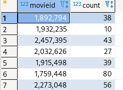
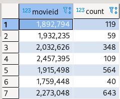
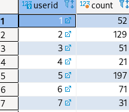

### 3. Some SQL queries to explore tables

```sql
-- some queries to explore the table

select * from actors limit 4;
select * from directors limit 5;
select * from movies m  limit 6;
select * from movies2actors ma limit 7;
```

##### output: 3.243986

#### 4. SQL queries to explore the tables

##### I. average rating of all movies

```sql
-- average rating of all movies
create view average_rating as 
(select movieid, avg(CAST(rating as integer)) from u2base as u
natural join movies group by movieid); 

select * from average_rating;
```

##### II. number of actors in each movie
```sql
-- number of actors in each movie
create view number_of_actors as 
(select movieid, count(actorid) from actors 
natural join movies2actors group by movieid);
select * from number_of_actors;
```



##### III. number of ratings for each movie 
```sql
-- number of ratings for each movieid 

create view number_of_ratings as 
(select movieid, count(CAST(rating as integer)) from u2base as u 
natural join movies 
group by movieid); 
select * from number_of_ratings;
```



##### IV. number of ratings by each user 

```sql
-- number of ratings by each user 
select userid, count(movieid) from u2base ub 
natural join movies 
group by userid 
order by userid ASC;
```



#### 5. Find the number of unrated movies

```sql
-- number of users who have rated atleast one movies 
select count(c.count) from
(select count(u.userid) from users as u 
inner join u2base as ub 
on u.userid = ub.userid group by u.userid) as c;
```


##### Output: 6039

#### 6. Find the number of unrated movies
```sql
-- number of users who have rated atleast one movies 
select count(c.count)from 
(select count(u.userid) from users as u 
inner join u2base as ub on u.userid = ub.userid 
group by u.userid) as c;
```

##### Output: 

|movieid|year   |isenglish|country|runningtime|
|-------|-------|---------|-------|-----------|
|1673647|3      |F        |France |3          |
|1684910|4      |T        |USA    |1          |
|1688565|4      |T        |UK     |2          |
|1690710|4      |T        |USA    |1          |
|1690958|4      |T        |other  |2          |
|1697774|4      |T        |other  |1          |
|1710609|3      |F        |other  |2          |
|1719614|1      |T        |UK     |1          |
|1729579|2      |F        |other  |1          |


#### 7. Find 10 highest rated movies and the actors who played in those movies.

```sql
select * from movies2actors where movieid in 
(select movieid from average_rating 
	order by avg desc limit 10);
```

|movieid|actorid|cast_num|
|-------|-------|--------|
|2525874|421093 |1       |
|2525874|432319 |1       |
|2525874|1288587|1       |
|2525874|2317264|1       |
|2525874|2469995|1       |
|2525874|46314  |2       |
|2525874|486217 |2       |
|2525874|493203 |2       |
|2525874|735522 |2       |
|2525874|741168 |2       |
|2525874|955582 |2       |
|2525874|1466500|2       |
|2525874|1509917|2       |
|2525874|1613572|2       |
|2525874|2009197|2       |
|2525874|2315719|2       |
|2525874|2453123|2       |


